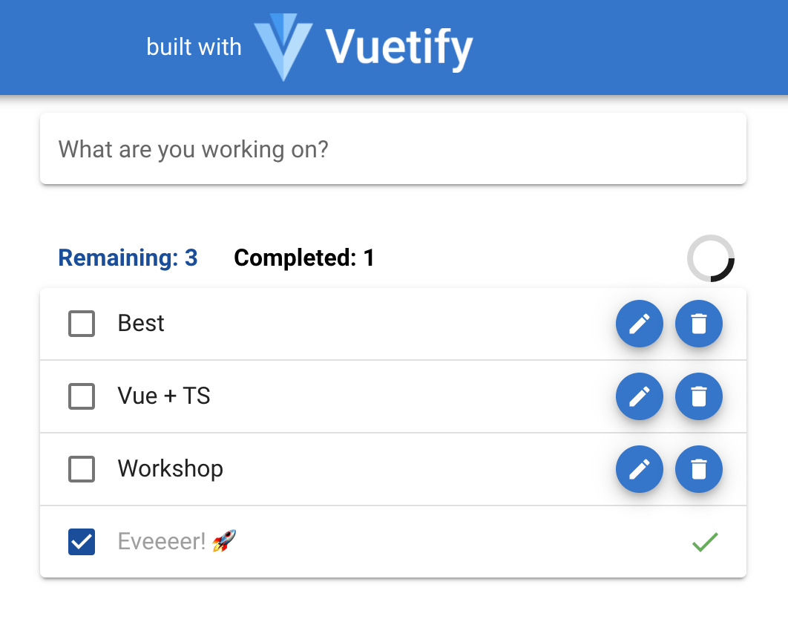

# Vue (2.6.11 - latest v2 realese) & TS - workshop (class component)
Welcome to Vue workshop! :)

In this tutorial we will lern the basics of the awesoeme Vue.js framework + TS by creating a basic to-do list.
Please make sure to have the latest npm+node versions installed.

## Prerequisites:
   install vs-code or else IDE
   
   install node (lts)
   
   install vue-cli
   
   install [vue-generate-component-typescript]( https://github.com/Kamar-Meddah/vue-generate-component-typescript)

Stay tuned! ⚡️

